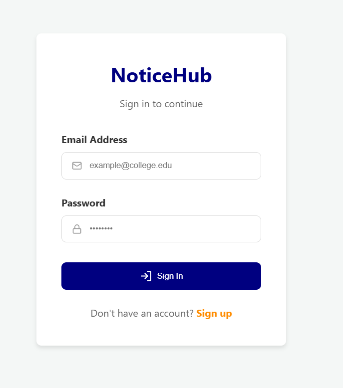
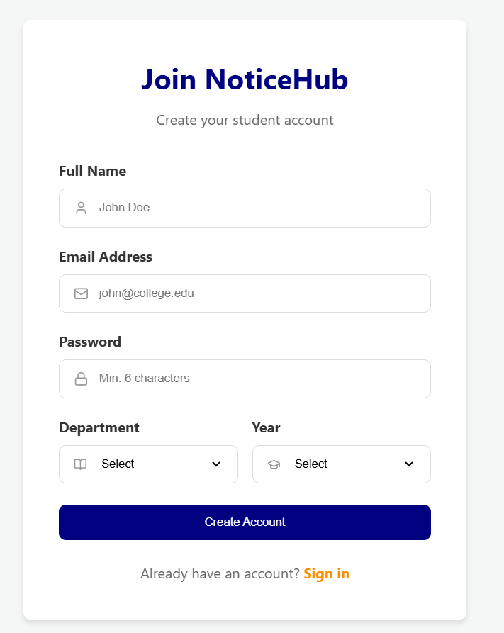
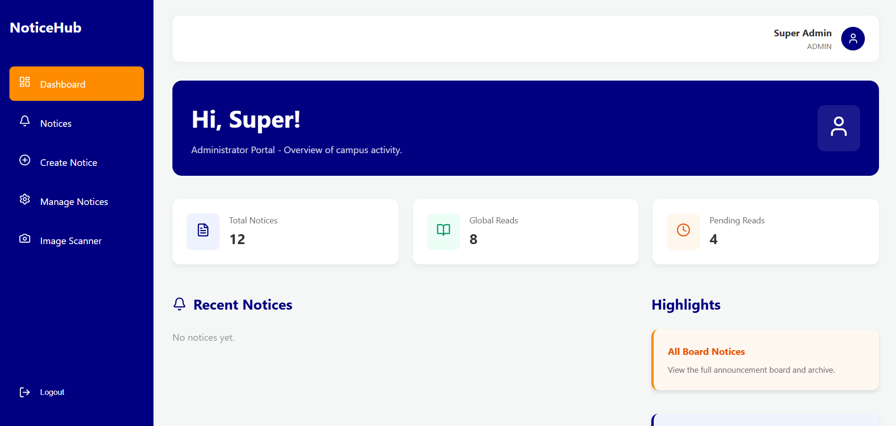
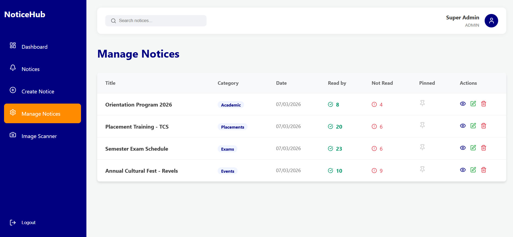
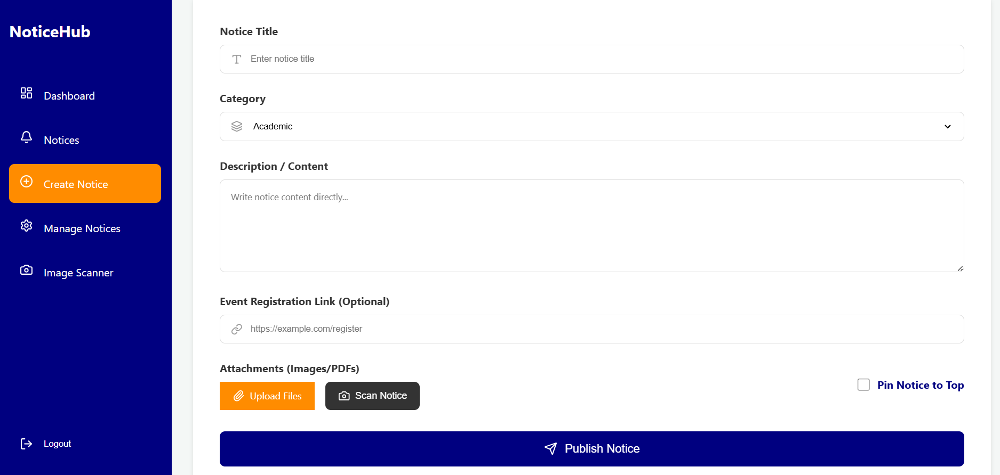
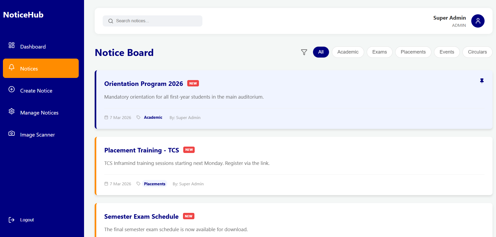
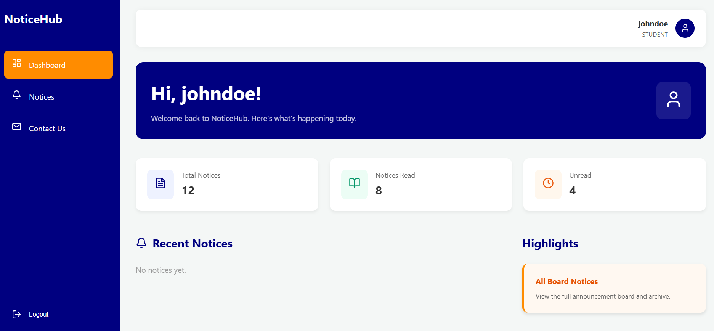
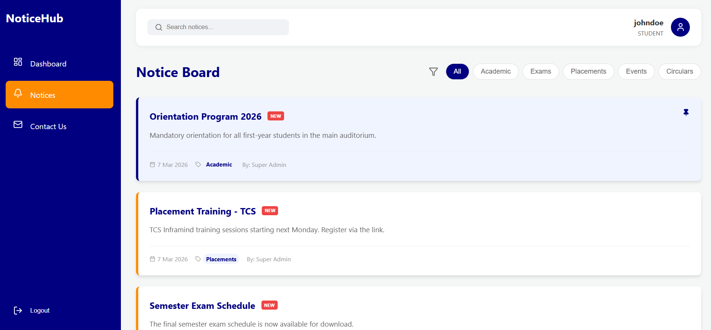
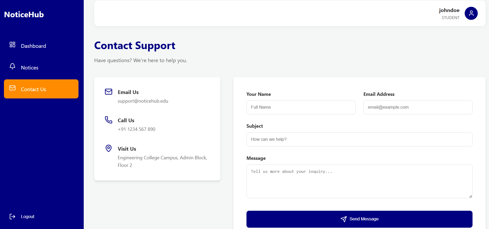

#  NoticeHub: Smart Notice & Analytics System

NoticeHub is a modern, full-stack campus communication platform designed to streamline the broadcasting of academic notices and placement drives. It features role-based dashboards, real-time analytics, and a centralized notice board.

---

##  UI Walkthrough & Features

The following screenshots demonstrate the core functionalities and the user experience of NoticeHub.

### 1. Authentication & Onboarding
| Login Page | Signup Page |
| :---: | :---: |
|  |  |
| **Secure Access**: Simple and secure login for both Admins and Students. | **Role-Based Registration**: Students can register with their Department and Graduation Year. |

### 2. Admin Perspective
| Admin Dashboard | Management Panel |
| :---: | :---: |
|  |  |
| **Global Insights**: Admins see student engagement metrics across all notices. | **Full Control**: Edit, delete, or pin important notices for maximum visibility. |

| Create New Notice | Admin Notice Feed |
| :---: | :---: |
|  |  |
| **Rich Content**: Support for categories, descriptions, and file attachments (Images/PDFs). | **Search & Filter**: Admins can quickly find any announcement using keyword search. |

### 3. Student Perspective
| Student Dashboard | Student Notice Board |
| :---: | :---: |
|  |  |
| **Personalized View**: Tracks personal reading progress (Read vs Unread). | **Engagement**: Clean, chronologically sorted notices with "Read" status indicators. |

### 4. Support
| Contact Us |
| :---: |
|  |
| **Student Helpdesk**: A dedicated space for students to reach out for assistance. |

---

##  Demo Access

To make testing easier, the project includes seeded dummy data.

### Admin Account (Demo)
*   **Email:** `admin@noticehub.com`
*   **Password:** `password123`

### Student Access
Student users can register through the **Signup** page to explore their personalized dashboard.

---

##  Tech Stack

- **Frontend:** React (Vite), CSS3, Lucide Icons, React Toastify.
- **Backend:** Node.js, Express.js.
- **Database:** MongoDB (Mongoose).
- **Architecture:** Role-Based Access Control (RBAC), JWT Authentication.

---

##  Getting Started

### Option A: Run with Docker (Recommended)
```bash
git clone https://github.com/your-username/NoticeHub.git
cd NoticeHub
docker-compose up --build
```
- **Frontend**: `http://localhost:5173`
- **Backend**: `http://localhost:5000`

### Option B: Run Manually (Local Setup)
**Backend:**
1. `cd backend && npm install`
2. Create `.env` (MONGO_URI, JWT_SECRET)
3. `npm run dev`

**Frontend:**
1. `cd frontend && npm install`
2. Create `.env` (VITE_API_URL)
3. `npm run dev`

---

##  Project Structure
```text
NoticeHub
├── frontend/             # React Application
├── backend/              # Node.js API
├── screenshots/          # Application Images
├── docker-compose.yml    # Container Config
└── README.md             # Project Documentation
```

---
